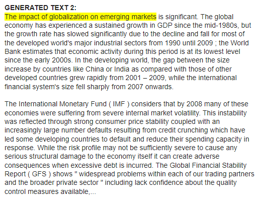
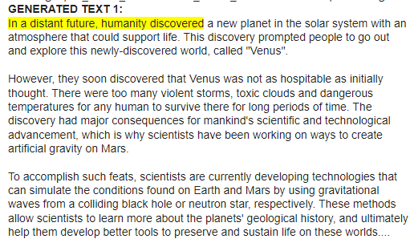
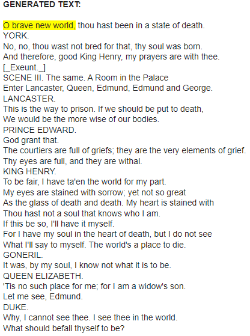
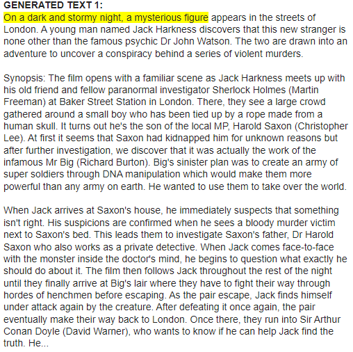
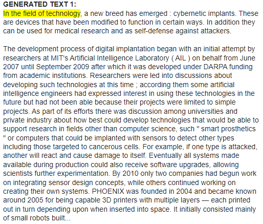

# <h1 align="center">**Causal Language Modeling**</h1>

 

In this repository, Causal Language Modeling is implemented, a natural language processing (NLP) task that involves predicting the next token in a sequence of tokens, where the model can only attend to the tokens on its left, meaning it cannot see future tokens, as is the case with GPT-2. The most common use of these models is in text generation, which involves completing or paraphrasing an incomplete text. These models are created using the TensorFlow and Hugging Face Transformers libraries.

The most significant use cases include creative content generation, text autocompletion, assisted writing, and realistic dialogue creation for chatbot applications.

## **Implemented Models:**

- **Shakespeare-Style Text Generation:** A [LSTM network](https://www.tensorflow.org/api_docs/python/tf/keras/layers/LSTM) model is implemented using a [dataset containing Shakespeare's writings](https://storage.googleapis.com/download.tensorflow.org/data/shakespeare.txt). Subsequently, to achieve better results, the pre-trained [DistilGPT2 (short for Distilled-GPT2)](https://huggingface.co/distilbert/distilgpt2) model is fine-tuned using a larger dataset from the official [Project Gutenberg](https://www.gutenberg.org/cache/epub/100/pg100.txt) page that contains Shakespeare's major works, thus improving coherence, spelling, and capturing Shakespeare's style.

- **Text Generation with GPT-2:** In this case, the [GPT-2](https://huggingface.co/openai-community/gpt2) model is fine-tuned with the [WikiText-103](https://huggingface.co/datasets/Salesforce/wikitext) dataset, which is a collection of over 100 million tokens extracted from articles verified as good and featured on Wikipedia, enabling the model to generate relevant text in fields such as art, history, philosophy, medicine, technology, economics, and more.

- **Text Generation with GPT-2 XL:** Here, the [GPT-2 XL](https://huggingface.co/openai-community/gpt2-xl) model is used without any additional fine-tuning. This is the largest model in the GPT-2 series, with over 1.5 billion parameters, and has achieved the best results across various datasets.

## **Some Results**

 

---

 

---

 

---

 

---

 

#### *Further results can be found in their respective notebooks.*

## **Technological Stack**
 

## **Contact**

